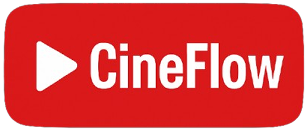

# CineFlow

A Netflix-inspired movie streaming platform built with Django REST Framework and Angular. This application allows users to upload, stream, edit, and manage movies with a modern and responsive user interface.



## Features

- 🎬 Upload and stream movies
- 🖼️ Automatic thumbnail generation
- ✏️ Edit movie details
- 🗑️ Delete movies
- 📱 Responsive Netflix-like interface
- 🎨 Modern UI with Tailwind CSS

## Tech Stack

- **Frontend:**
  - Angular 19
  - TailwindCSS
  - FontAwesome
  - TypeScript

- **Backend:**
  - Django 5.1
  - Django REST Framework
  - SQLite3

## Prerequisites

Before you begin, ensure you have the following installed:
- Python 3.8+
- Node.js 20.11+ (required for Angular 19)
- npm 10+ or yarn
- Git

## Installation

### 1. Clone the Repository

```bash
git clone https://github.com/jerald-devOfficial/CineFlow.git
cd CineFlow
```

### 2. Backend Setup

```bash
# Navigate to backend directory
cd backend

# (Recommended) Create and activate virtual environment
python -m venv venv
source venv/bin/activate  # On Windows use: venv/Scripts/activate

# Quick Setup (Not Recommended - Skip virtual environment)
# Note: This might affect other Python projects on your system
# pip install -r requirements.txt

# Install dependencies (after activating virtual environment)
pip install -r requirements.txt

# Run migrations
python manage.py migrate

# Start the Django development server
python manage.py runserver
```

⚠️ **Important**: Using a virtual environment is highly recommended for:
- Preventing package conflicts
- Easy dependency management
- Clean project setup/teardown
- Consistent development environment

The backend server will start at `http://localhost:8000`

### 3. Frontend Setup

```bash
# Navigate to frontend directory
cd app

# Install dependencies
npm install

# Start the Angular development server
ng serve
```

The application will be available at `http://localhost:4200`

## Usage

1. Open your browser and navigate to `http://localhost:4200`
2. Use the upload button to add new movies
3. Click on a movie to:
   - Play the movie
   - Edit movie details
   - Delete the movie
4. Enjoy your personal movie streaming platform!

## API Endpoints

- `GET /api/movie/` - List all movies
- `POST /api/movie/` - Upload a new movie
- `GET /api/movie/<id>/` - Retrieve movie details
- `PATCH /api/movie/<id>/` - Update movie details
- `DELETE /api/movie/<id>/` - Delete a movie